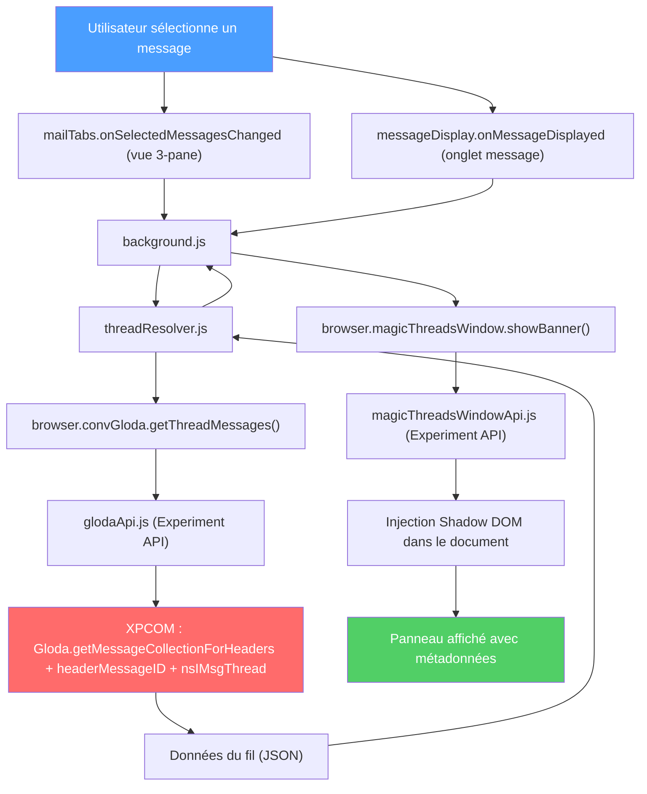
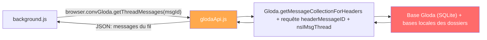
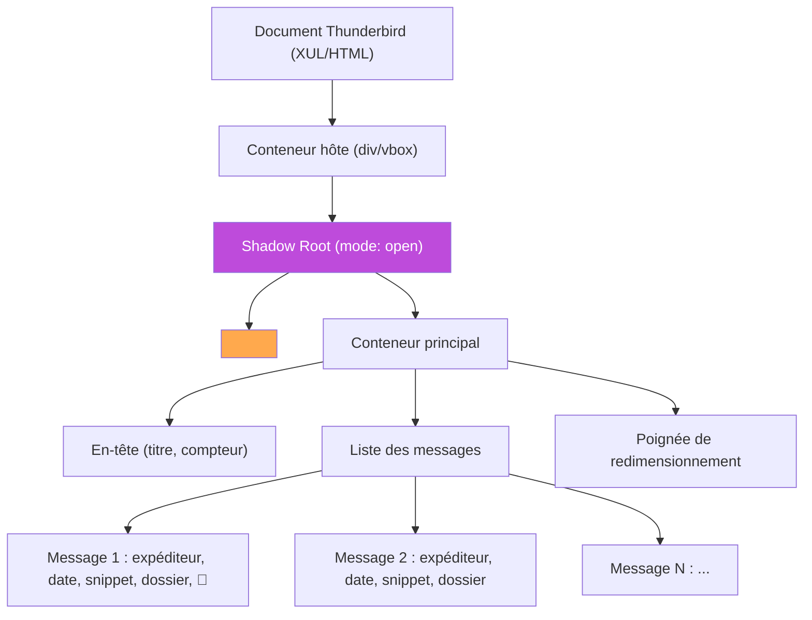
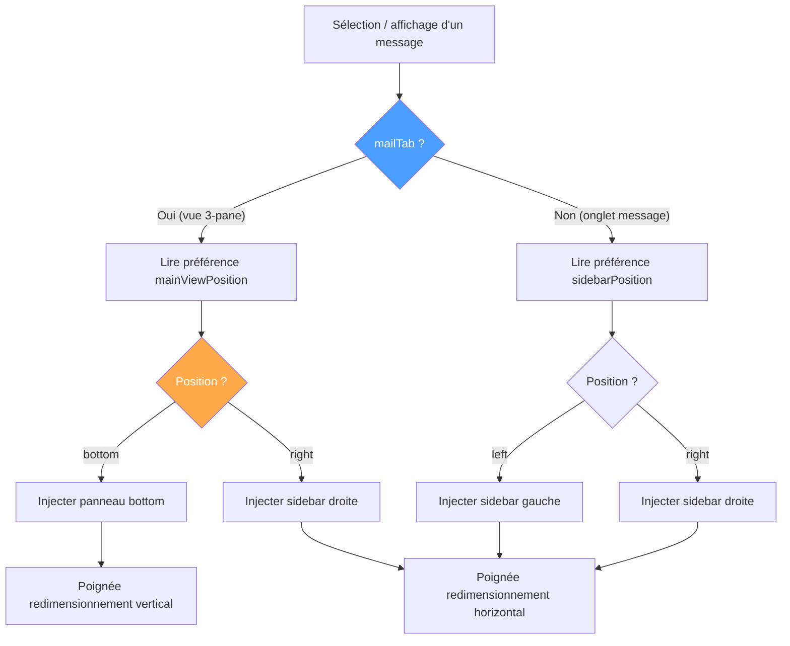
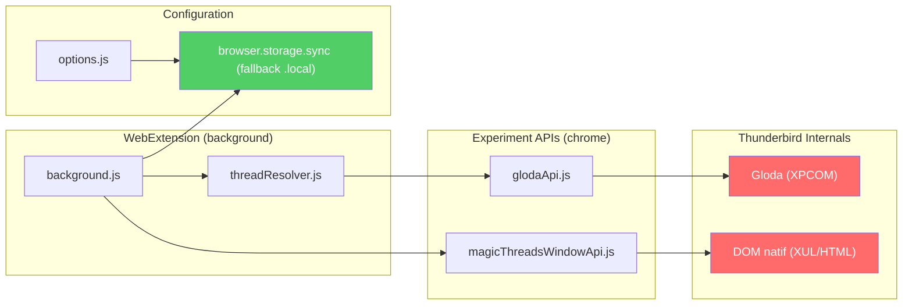

# Architecture de Magic Threads

Ce document décrit l'architecture technique de l'extension Magic Threads pour Thunderbird.

## Flux de données global

Deux écouteurs alimentent le même pipeline : `mailTabs.onSelectedMessagesChanged`
pour la vue 3-pane (avec masquage du panneau en cas de multi-sélection ou de
désélection) et `messageDisplay.onMessageDisplayed` pour les onglets message.

## Composants

### 1. Background Scripts (contexte WebExtension)

#### `background/background.js`

Point d'entrée de l'extension. Responsabilités :

- **Écoute des événements** : `browser.messageDisplay.onMessageDisplayed` pour détecter la sélection d'un message
- **Coordination** : orchestre les appels entre le ThreadResolver et l'API Window
- **Préférences** : lit et applique les paramètres utilisateur via `browser.storage.sync` (avec fallback depuis `browser.storage.local`)
- **Navigation** : gère les clics sur les messages du fil (intra-onglet ou nouvel onglet)
- **Détection du contexte** : distingue la vue 3-pane des onglets message

#### `background/threadResolver.js`

Proxy simple (Data Access Layer) pour l'accès aux données :

- Appelle `browser.convGloda.getThreadMessages()` avec l'identifiant du message
- Délègue entièrement à l'Experiment API Gloda sans transformation ni formatage
- Retourne directement les résultats de l'API sans normalisation
- Gère les cas d'erreur (API non disponible, message non indexé)

### 2. Experiment APIs (contexte chrome)

#### `experiment-api/glodaApi.js`

Experiment API pour l'accès à Gloda :

- S'exécute dans le contexte chrome avec accès XPCOM complet
- `resolveFullThread` réunit trois sources : la conversation Gloda du message
  (`getMessageCollectionForHeaders`), le fil local du dossier (`nsIMsgThread`,
  ce qu'affiche la liste de messages) et les conversations sœurs retrouvées en
  suivant les en-têtes `References` (requête Gloda `headerMessageID`), avec
  dédoublonnage par `Message-ID` et expansion bornée
- Retourne un tableau JSON sérialisable de métadonnées de messages
- Expose aussi `isGlodaAvailable()` (v2.3.0) : vérifie la préférence `mailnews.database.global.indexer.enabled` et le chargement du module Gloda — utilisé par la page d'options pour avertir si l'index est désactivé
- Schéma défini dans `glodaSchema.json`

#### `experiment-api/magicThreadsWindowApi.js`

Experiment API pour l'injection DOM :

- Accède au document de la fenêtre Thunderbird active
- Crée et injecte le panneau dans un **Shadow DOM**
- Gère les trois modes d'affichage (bottom panel en 3-pane / sidebar en 3-pane / sidebar en onglet message)
- Injecte les styles CSS dans le Shadow DOM
- Gère le nettoyage du DOM quand le message change
- Schéma défini dans `magicThreadsWindowSchema.json`

### 3. Options (contexte WebExtension)

#### `options/options.html` + `options.js`

Page de paramètres accessible depuis le gestionnaire de modules complémentaires :

- **Mode de navigation** : intra-onglet ou nouvel onglet
- **Position du sidebar** en onglet message : gauche ou droite
- **Position du panneau** en vue 3-pane : bottom, gauche ou droite
- Persistance via `browser.storage.sync` (avec fallback depuis `browser.storage.local`)

## Structure du Shadow DOM

Le panneau injecté utilise un Shadow DOM pour l'isolation CSS complète :

### Pourquoi Shadow DOM ?

1. **Isolation CSS** : les styles du panneau ne peuvent pas affecter l'interface native de Thunderbird
2. **Protection contre les styles externes** : les styles de Thunderbird ne polluent pas le panneau
3. **Encapsulation** : le DOM interne n'est pas accessible par d'autres extensions ou scripts

## Architecture CSS

### Styles partagés

Les styles communs aux trois modes (bottom, sidebar 3-pane et sidebar onglet message) sont définis dans une base commune :

- Typographie et couleurs (variables CSS)
- Styles des éléments de message (expéditeur, date, snippet)
- Indicateur de pièces jointes
- Mise en surbrillance du message courant
- Adaptation au thème sombre via `prefers-color-scheme` et variables `--lwt-*`

### Styles spécifiques au mode

| Mode | Contexte | Disposition | Redimensionnement |
|------|----------|-------------|-------------------|
| **Bottom** | Vue 3-pane | Vertical, sous le message | Poignée verticale (hauteur) |
| **Sidebar (3-pane)** | Vue 3-pane | Horizontal, à côté du message | Poignée horizontale (largeur) |
| **Sidebar (onglet message)** | Onglet message | Horizontal, à côté du message | Poignée horizontale (largeur) |

## Logique de navigation

> **Note.** En vue 3-pane, `mainViewPosition` ne prend que `bottom` ou `right` :
> l'option « gauche » a été retirée en v2.2.0 (valeur stockée migrée vers
> `right`). La position gauche reste disponible en **onglet message**
> (`sidebarPosition`).

### Clic sur un message du fil

Quand l'utilisateur clique sur un message dans le panneau, `handleOpenMessage`
suit l'un de **trois chemins** selon le contexte et le mode de navigation :

1. **Onglet message** (`activeTab` non `mailTab`) : navigation dans le même
   onglet via `magicThreadsWindow.navigateMessageTab` (Experiment API) ; repli
   sur `browser.messageDisplay.open()` en nouvel onglet si l'appel échoue.
2. **Vue 3-pane, mode « nouvel onglet »** : `browser.messageDisplay.open()`
   ouvre le message dans un nouvel onglet.
3. **Vue 3-pane, mode « onglet courant »** : `mailTabs.update` change le dossier
   affiché puis `mailTabs.setSelectedMessages` sélectionne le message ciblé
   (repli sur `messageDisplay.open()` si aucun `mailTab` n'est disponible).

## Contraintes et problèmes connus

### Contraintes techniques

| Contrainte | Impact | Solution |
|-----------|--------|----------|
| Experiment APIs en contexte chrome | Pas d'accès à `browser.i18n` | Passer les traductions depuis le background |
| Dates cross-compartment XPCOM | `instanceof Date` échoue | Convertir en timestamp avant transmission |
| DOM en vue 3-pane | `messagePane` est un custom element HTML dans un grid CSS, `messageBrowser` est un `<browser>` XUL | Sidebar 3-pane utilise `position:absolute` dans le `messagePane` + marge sur `messageBrowser` |
| Shadow DOM ouvert | Accès possible au DOM interne pour le debugging | Toute la logique DOM dans l'Experiment API |
| Timer.sys.mjs obligatoire | `setTimeout`/`clearTimeout` non disponibles dans le contexte chrome | Import explicite depuis `resource://gre/modules/Timer.sys.mjs` |

### Limitations actuelles

- **Pas de mise à jour en temps réel** : si un nouveau message arrive dans le fil pendant l'affichage, le panneau ne se met pas à jour automatiquement
- **Dépendance à Gloda** : les messages non indexés par Gloda n'apparaissent pas dans le fil
- **Experiment APIs** : nécessitent une mise à jour si les APIs internes de Thunderbird changent entre versions majeures

## Diagramme des dépendances

