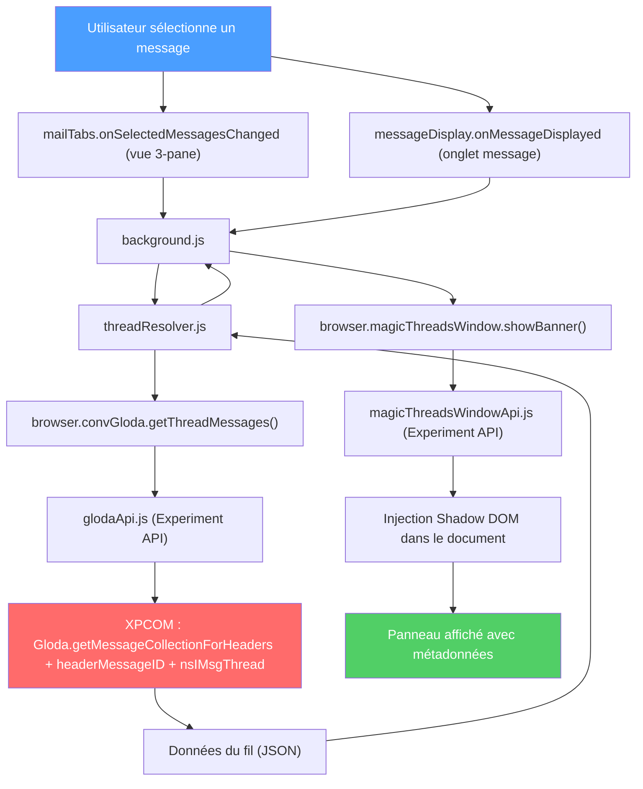
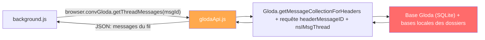
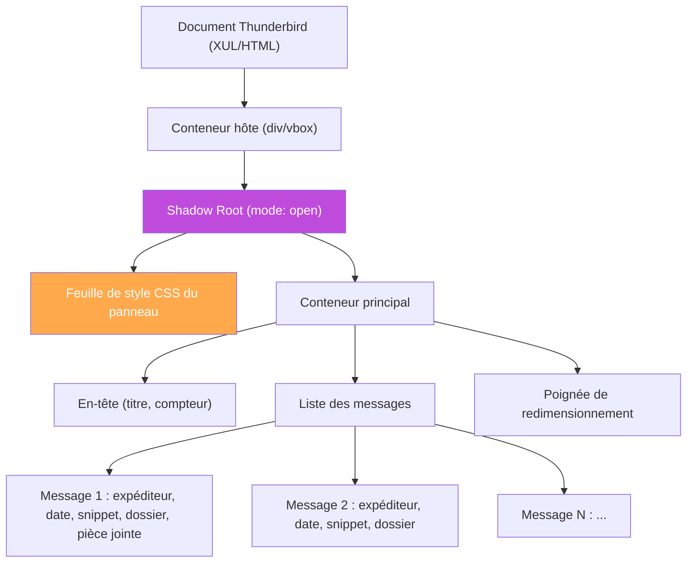
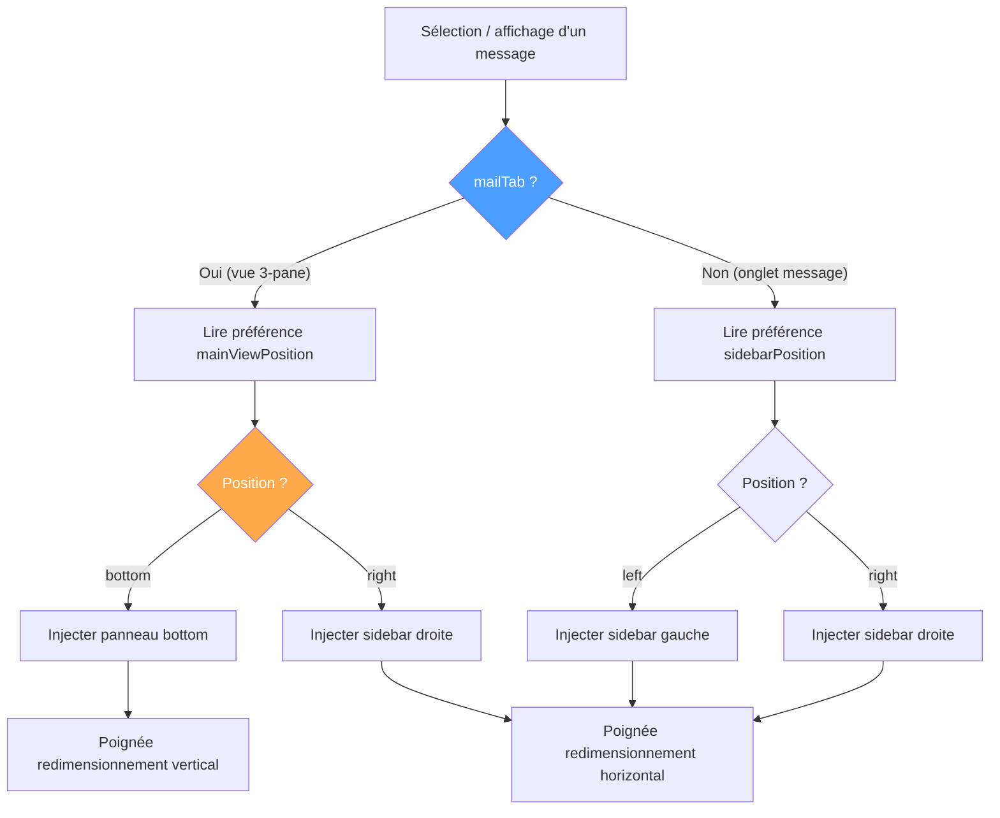
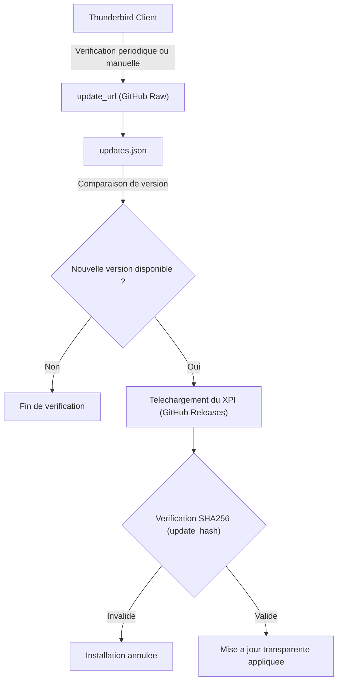
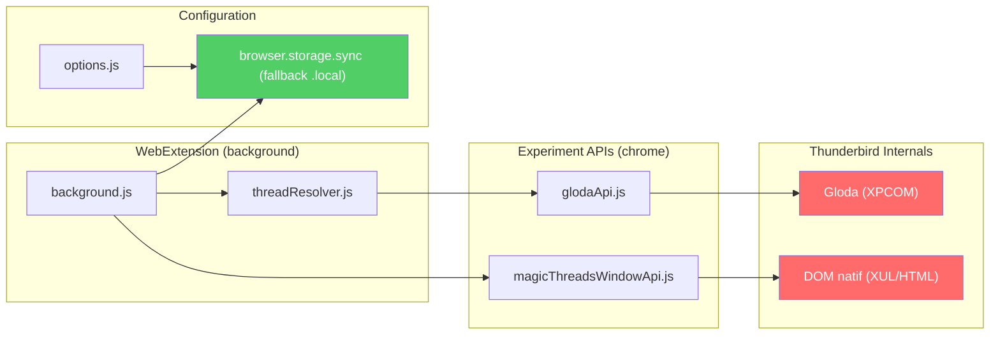

# Architecture de Magic Threads

Ce document décrit l'architecture technique de l'extension Magic Threads pour Thunderbird.

## Flux de données global

Deux écouteurs alimentent le même pipeline : `mailTabs.onSelectedMessagesChanged`
pour la vue 3-pane (avec masquage du panneau en cas de multi-sélection ou de
désélection) et `messageDisplay.onMessageDisplayed` pour les onglets message.

## Composants

### 1. Background Scripts (contexte WebExtension)

#### `background/background.js`

Point d'entrée de l'extension. Responsabilités :

- **Écoute des événements** : `browser.messageDisplay.onMessageDisplayed` pour détecter la sélection d'un message
- **Coordination** : orchestre les appels entre le ThreadResolver et l'API Window
- **Préférences** : lit et applique les paramètres utilisateur via `browser.storage.sync` (avec fallback depuis `browser.storage.local`)
- **Navigation** : gère les clics sur les messages du fil (intra-onglet ou nouvel onglet)
- **Détection du contexte** : distingue la vue 3-pane des onglets message

#### `background/threadResolver.js`

Proxy simple (Data Access Layer) pour l'accès aux données :

- Appelle `browser.convGloda.getThreadMessages()` avec l'identifiant du message
- Délègue entièrement à l'Experiment API Gloda sans transformation ni formatage
- Retourne directement les résultats de l'API sans normalisation
- Gère les cas d'erreur (API non disponible, message non indexé)

### 2. Experiment APIs (contexte chrome)

#### `experiment-api/glodaApi.js`

Experiment API pour l'accès à Gloda :

- S'exécute dans le contexte chrome avec accès XPCOM complet
- `resolveFullThread` réunit trois sources : la conversation Gloda du message
  (`getMessageCollectionForHeaders`), le fil local du dossier (`nsIMsgThread`,
  ce qu'affiche la liste de messages) et les conversations sœurs retrouvées en
  suivant les en-têtes `References` (requête Gloda `headerMessageID`), avec
  dédoublonnage par `Message-ID` et expansion bornée.
- **Normalisation des Message-IDs** : Les identifiants extraits des en-têtes XPCOM (contenant des chevrons `<...>`) sont systématiquement normalisés sans chevrons pour garantir la parfaite correspondance avec les IDs indexés dans Gloda (anti-doublon strict et reconstitution intégrale des chaînes `References`).
- **Dédoublonnage intelligent Gmail** : La détection `isAllMailFolder` normalise les URIs IMAP (nettoyage des paramètres et slashs terminaux) et identifie le dossier virtuel *Tous les messages* de Gmail de manière insensible à la casse dans 22 langues. La logique fusionne les doublons en privilégiant les e-mails dans des dossiers précis (Boîte de réception, Envoyés) tout en préservant le snippet indexé de Gloda.
- **Gestion du cycle de vie** : Implémente `onShutdown` pour purger immédiatement tous les timers asynchrones (`safeSetTimeout`) lors du déchargement ou de la mise à jour de l'extension.
- Retourne un tableau JSON sérialisable de métadonnées de messages
- Expose aussi `isGlodaAvailable()` (v2.3.0) : vérifie la préférence `mailnews.database.global.indexer.enabled` et le chargement du module Gloda — utilisé par la page d'options pour avertir si l'index est désactivé
- Schéma défini dans `glodaSchema.json`

#### `experiment-api/magicThreadsWindowApi.js`

Experiment API pour l'injection DOM :

- Accède au document de la fenêtre Thunderbird active
- Crée et injecte le panneau dans un **Shadow DOM**
- Gère les trois modes d'affichage (bottom panel en 3-pane / sidebar en 3-pane / sidebar en onglet message)
- Injecte les styles CSS dans le Shadow DOM
- Gère le nettoyage du DOM quand le message change
- Schéma défini dans `magicThreadsWindowSchema.json`

### 3. Options (contexte WebExtension)

#### `options/options.html` + `options.js`

Page de paramètres accessible depuis le gestionnaire de modules complémentaires :

- **Mode de navigation** : intra-onglet ou nouvel onglet
- **Position du sidebar** en onglet message : gauche ou droite
- **Position du panneau** en vue 3-pane : bottom, gauche ou droite
- Persistance via `browser.storage.sync` (avec fallback depuis `browser.storage.local`)

## Structure du Shadow DOM

Le panneau injecté utilise un Shadow DOM pour l'isolation CSS complète :

### Pourquoi Shadow DOM ?

1. **Isolation CSS** : les styles du panneau ne peuvent pas affecter l'interface native de Thunderbird
2. **Protection contre les styles externes** : les styles de Thunderbird ne polluent pas le panneau
3. **Encapsulation** : le DOM interne n'est pas accessible par d'autres extensions ou scripts

## Architecture CSS

### Styles partagés

Les styles communs aux trois modes (bottom, sidebar 3-pane et sidebar onglet message) sont définis dans une base commune :

- Typographie et couleurs (variables CSS)
- Styles des éléments de message (expéditeur, date, snippet)
- Indicateur de pièces jointes
- Mise en surbrillance du message courant
- Adaptation au thème sombre via `prefers-color-scheme` et variables `--lwt-*`

### Styles spécifiques au mode

| Mode | Contexte | Disposition | Redimensionnement |
|------|----------|-------------|-------------------|
| **Bottom** | Vue 3-pane | Vertical, sous le message | Poignée verticale (hauteur) |
| **Sidebar (3-pane)** | Vue 3-pane | Horizontal, à côté du message | Poignée horizontale (largeur) |
| **Sidebar (onglet message)** | Onglet message | Horizontal, à côté du message | Poignée horizontale (largeur) |

## Logique de navigation

> **Note.** En vue 3-pane, `mainViewPosition` ne prend que `bottom` ou `right` :
> l'option « gauche » a été retirée en v2.2.0 (valeur stockée migrée vers
> `right`). La position gauche reste disponible en **onglet message**
> (`sidebarPosition`).

### Clic sur un message du fil

Quand l'utilisateur clique sur un message dans le panneau, `handleOpenMessage`
suit l'un de **trois chemins** selon le contexte et le mode de navigation :

1. **Onglet message** (`activeTab` non `mailTab`) : navigation dans le même
   onglet via `magicThreadsWindow.navigateMessageTab` (Experiment API) ; repli
   sur `browser.messageDisplay.open()` en nouvel onglet si l'appel échoue.
2. **Vue 3-pane, mode « nouvel onglet »** : `browser.messageDisplay.open()`
   ouvre le message dans un nouvel onglet.
3. **Vue 3-pane, mode « onglet courant »** : `mailTabs.update` change le dossier
   affiché puis `mailTabs.setSelectedMessages` sélectionne le message ciblé
   (repli sur `messageDisplay.open()` si aucun `mailTab` n'est disponible).

### Résilience de la sélection (Envois récents)

La sélection programmée de messages (en particulier après un envoi récent) fait face aux limites asynchrones de l'indexation de Thunderbird et de l'écriture des fichiers de dossier.

1. **Délai de sécurité des messages récents** : Si l'e-mail a été envoyé depuis moins de 5 minutes, une temporisation fixe de 250 ms est systématiquement appliquée. Cela évite d'ouvrir le dossier et de forcer la sélection alors que le fichier physique de dossier/index est verrouillé ou en cours d'écriture locale.
2. **Boucle de validation de sélection différenciée (Adaptive Retry Loop)** : La fonction `setSelectedMessagesWithRetry` adapte sa stratégie selon le contexte de navigation :
   - **Même dossier (`isFolderChange === false`)** : Déterminé par comparaison stricte des attributs d'identité `{ accountId, path }` des dossiers. Une seule tentative immédiate (0 ms d'attente). Si le message est masqué par un filtre rapide actif, l'échec est constaté instantanément, déclenchant le fallback d'affichage direct sans délai perceptible (~200 ms au total).
   - **Changement de dossier (`isFolderChange === true`)** : 6 tentatives rapides espacées de 30 ms (180 ms max au lieu des 500 ms d'origine) pour laisser à Thunderbird le temps de charger la base du dossier.

### Zéro scintillement & DOM Patching in-place

Pour garantir une expérience 60 fps et éliminer tout clignotement lors de la navigation intra-fil :

1. **DOM Patching in-place (`tryUpdateBannerDOM`)** : Lors de la navigation au sein d'une même conversation, le panneau compare la signature des identifiants du fil (`threadSignature`). Si le fil est identique, le Shadow DOM n'est pas détruit : seuls les états actifs (`.current`, `aria-current`, `aria-disabled`) et les pastilles de lecture (`unread`) sont mis à jour chirurgicalement.
2. **UI Optimiste (Instant Feedback)** : Dès l'événement utilisateur (`click`/`keydown`), la pastille de sélection active bascule immédiatement sur l'item cliqué avant même que Thunderbird ne traite le chargement effectif du corps du message.

### Fallback d'Affichage Direct (Quick Filter & Messages Filtrés)

Lorsqu'une recherche ou un filtre rapide est actif dans la vue 3-pane de Thunderbird (ex: filtrage sur un expéditeur spécifique) :
- Un message appartenant au même fil mais ne répondant pas aux critères du filtre est absent de la liste affichée dans l'arbre des messages (`treeView`).
- `mailTabs.setSelectedMessages` échoue à sélectionner ce message hors vue.
- **Résolution** : `handleOpenMessage` déclenche automatiquement le fallback `browser.magicThreadsWindow.displayMessageDirectly(mailTab.id, messageId)`. Celui-ci accède directement au visualiseur via le composant de haut niveau `messagePane.displayMessage(msgURI)` (ou `msgBrowser.contentWindow.displayMessage`), tout en restaurant impérativement la visibilité du visualiseur natif (`messageBrowser.hidden = false`) masqué par Thunderbird lors d'un résultat de filtre vide. Le filtre rapide de l'utilisateur n'est ni altéré ni réinitialisé, préservant son contexte de recherche tout en affichant instantanément l'e-mail désiré.

## Distribution & Auto-Update Autonome

En raison du refus d'ATN (addons.thunderbird.net) d'accepter les nouveaux add-ons exploitant des Experiment APIs, Magic Threads s'appuie sur le mécanisme natif Mozilla Gecko d'auto-hébergement et de distribution autonome.

### Protocole de mise à jour Gecko

1. **Point d'amorce (`manifest.json`)** : Déclare `update_url` dans `browser_specific_settings.gecko` pointant vers `updates.json`.
2. **Manifeste distant (`updates.json`)** : Renseigne la dernière version stable, l'URL de téléchargement de l'archive `.xpi` dans GitHub Releases et l'empreinte d'intégrité `update_hash: sha256:...`.
3. **Contrôle d'intégrité cryptographique** : Gecko valide l'empreinte SHA256 avant d'appliquer la mise à jour, garantissant une installation sécurisée et transparente en tâche de fond.

## Contraintes et problèmes connus

### Contraintes techniques

| Contrainte | Impact | Solution |
|-----------|--------|----------|
| Experiment APIs en contexte chrome | Pas d'accès à `browser.i18n` | Passer les traductions depuis le background |
| Dates cross-compartment XPCOM | `instanceof Date` échoue | Convertir en timestamp avant transmission |
| DOM en vue 3-pane | `messagePane` est un custom element HTML dans un grid CSS, `messageBrowser` est un élément XUL `browser` | Sidebar 3-pane utilise `position:absolute` dans le `messagePane` + marge sur `messageBrowser` |
| Shadow DOM ouvert | Accès possible au DOM interne pour le debugging | Toute la logique DOM dans l'Experiment API |
| Timer.sys.mjs obligatoire | `setTimeout`/`clearTimeout` non disponibles dans le contexte chrome | Import explicite depuis `resource://gre/modules/Timer.sys.mjs` |

### Limitations actuelles

- **Pas de mise à jour en temps réel** : si un nouveau message arrive dans le fil pendant l'affichage, le panneau ne se met pas à jour automatiquement
- **Dépendance à Gloda** : les messages non indexés par Gloda n'apparaissent pas dans le fil
- **Experiment APIs** : nécessitent une mise à jour si les APIs internes de Thunderbird changent entre versions majeures

## Diagramme des dépendances

